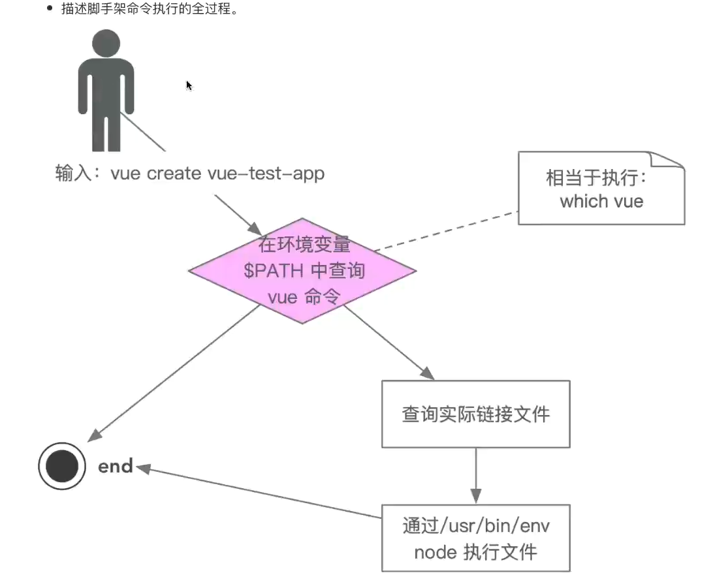
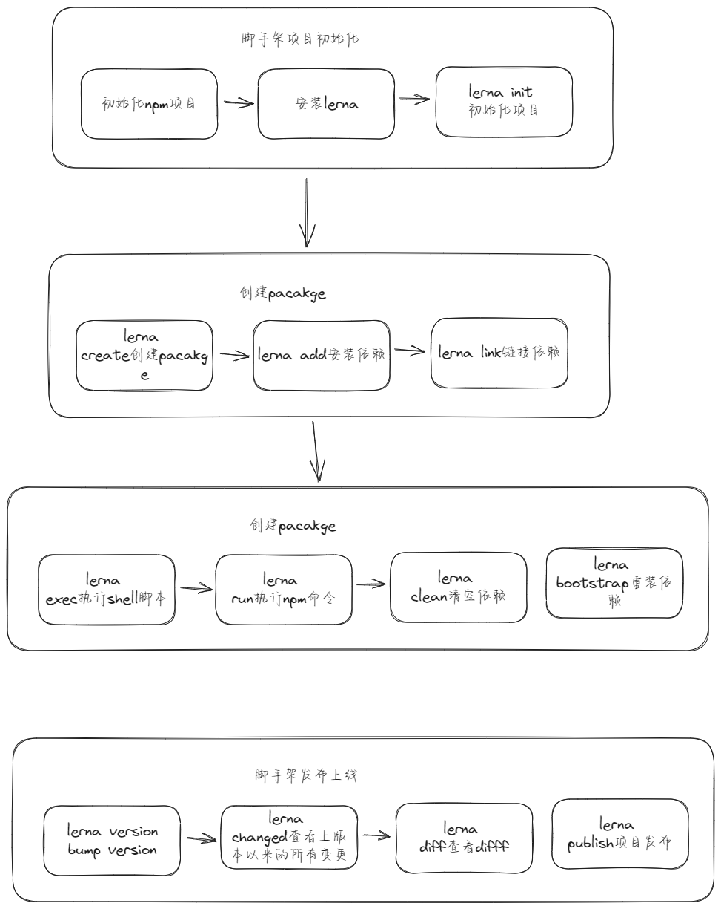

# 脚手架原理

## 脚手架实现原理

- 为什么全局安装@vue/cli 后会添加命令 vue?

`npm install -g @vue/cli`

源码里面有这么一段`package.json`

```json
{
  "name": "@vue/cli",
  "version": "5.0.8",
  "description": "Command line interface for rapid Vue.js development",
  "bin": {
    "vue": "bin/vue.js"
  }
}
```

这里其实已经说明问题了,通过 bin 目录创建 vue 命令，vue 命令本质指向的是 bin/vue.js，也就是启动脚手架，在 mac 系统中 vue 其实执项的是一个软链接，这个链接指向的就是全局安装下的@vue/cli 下的 bin/vue.js。

- 全局安装@vue/cli 时发生了什么

创建一个 vue 命令，指向 bin/vue.js

- 执行 vue 命令时发生了什么？为什么 vue 指向一个 js 文件，我们却可以直接通过 vue 命令去执行他

执行 vue 命令本质执行了 bin/vue.js，而这个文件当中开头会有一个注释`#!/usr/bin/env node`这段内容制定了需要用环境变量中的 node 环境执行一个文件。随便创建一个 test.js

```javascript
#!/usr/bin/env node
console.log('hello world")
```

在执行这个 test.js 的文件的时候我们可以直接通过./test.js 进行执行，而不是通过 node ./test.js

## 脚手架原理进阶

- 为什么说脚手架本质是操作系统的客户端？她和我们在 pc 上安装的应用、软件又什么区别？

node 本身就是一个客户端，我们在执行 node test.js 本质上是将 test.js 这个文本字符串交给了 node 进行解析并执行。 本质没有区别，都是可执行文件，node 没有提供 GUI 而已，通过命令进行交互而已

- 如何 node 脚手架命令创建别名

编写一个软链接`ln -s`创建一个软链接`ln -s imooc ./test.js`这样 test 就成了一个脚手架的命令.

如果需要创建别名`ln -s ./test test2`这样 test2 别名就可以了

- 描述脚手架命令执行的全过程



# 脚手架开发流程

## 脚手架开发流程详解

### 开发流程

- 创建npm项目
- 创建脚手架入口文件，最上方添加：

  ```javascript
  #!/usr/bin/env node
  ```
- 配置package.json，添加bin属性
- 编写脚手架代码
- 将脚手架发布到npm

### 使用流程

- 安装脚手架

  ```javascript
  npm install -g ekey-cli
  ```
- 使用脚手架

```javascript
ekey-cli
```

## 脚手架开发难点解析

- 分包：将复杂的系统拆分为若干个模块
- 命令注册：

```javascript
vue create
vue add 
vue invoke
```

- 参数解析

```javascript
vue command [options] <params>
```

- options 全称: `---version``--help`
- options简写：`-v -h`
- 带params的options:  `--path /Users/sam/Desktop/vue-test`
- 帮助文档：
  - global help
    - usage
    - options
    - commands

实例：vue的帮助信息：

```javascript
Options:  -V, --version                              output the version number
  -h, --help                                 display help for command

Commands:
  create [options] <app-name>                create a new project powered by vue-cli-service
  add [options] <plugin> [pluginOptions]     install a plugin and invoke its generator in an already created project
  invoke [options] <plugin> [pluginOptions]  invoke the generator of a plugin in an already created project
  inspect [options] [paths...]               inspect the webpack config in a project with vue-cli-service
  serve                                      alias of "npm run serve" in the current project
  build                                      alias of "npm run build" in the current project
  ui [options]                               start and open the vue-cli ui
  init [options] <template> <app-name>       generate a project from a remote template (legacy API, requires @vue/cli-init)
  config [options] [value]                   inspect and modify the config
  outdated [options]                         (experimental) check for outdated vue cli service / plugins
  upgrade [options] [plugin-name]            (experimental) upgrade vue cli service / plugins
  migrate [options] [plugin-name]            (experimental) run migrator for an already-installed cli plugin
  info                                       print debugging information about your environment
  help [command]                             display help for command

  Run vue <command> --help for detailed usage of given command.
```

- 命令行交互
- 日志打印
- 命令行文字变色
- 网络通信
- 文件处理

## 脚手架本地link标准流程

链接本地脚手架

```javascript
cd ekey-cli
npm link
```

- 链接本地库文件

```javascript
cd ekey-lib-dir
npm link
cd ekey-cli
npm link ekey-lib-dir
```

取消本地库文件

```javasript
cd your-lib-dir
npm unlink
cd your-cli-dir
npm unlink you-lib
```

理解npm link:

- `npm link your-lib`：将当前项目中node-modules下指定的库文件链接到node全局node-module下面的库文件
- npm link: 将当前项目连接到node全局node-modules中作为一个库文件，并解析bin配置创建可执行文件
  理解npm unlink：
- npm unlink：将当前项目从node全局node-modules中移除
- npm unlink you-lib：将当前项目中的库文件依赖移除
  全局 npm unlink

```javascript
npm unlink -g ekey-cli //删除当前link全局的包
```
## Lerna简介
### 原生脚手架开发痛点分析
- 痛点一：重复操作
  - 多package本地link
  - 多package依赖安装
  - 多package单元测试
  - 多package代码提交
  - 多pacakge代码发布
- 痛点二：版本一致性
  - 发布时版本一致性
  - 发布后相互依赖版本升级
> package越多，管理复杂度越高

### 优势
- 大幅减少重复操作
- 提升操作的标准化
> lerna是架构优化的产物，他揭示了一个架构真理：项目复杂度提升后，就需要对项目进行架构优化，优化的主要目标往往都是以效能为核心

### 脚手架流程



